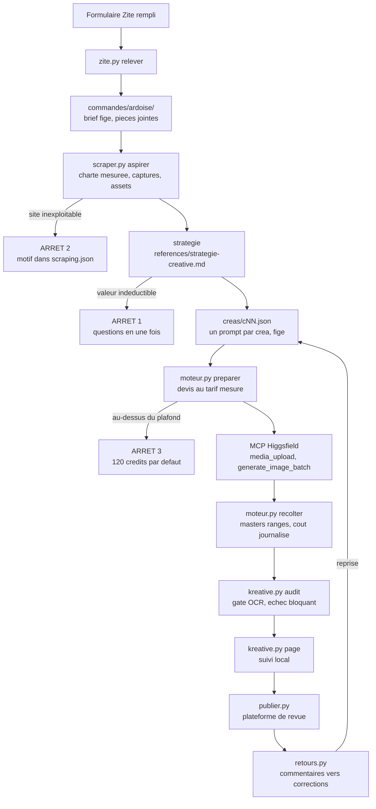

# Architecture de la chaîne

La carte du système : qui fait quoi, dans quel ordre, et où chaque décision
peut s'arrêter. Les modules vivent dans `scripts/`, les données dans l'espace
de travail (`KREATIVE_TRAVAIL`), le métier créatif dans `references/`.

## Le flux, du formulaire au pack

## Les modules

| module | rôle | ce qu'il écrit |
|---|---|---|
| `pipeline/zite.py` | relève l'API Zite, ouvre les commandes, fusionne une resoummission sous 30 jours | `commandes/_zite/`, `commandes/<ardoise>/brief/` |
| `pipeline/scraper.py` | parcourt le site dans Chromium, mesure les styles CALCULÉS, capture chaque page | `marque/charte-site.json`, `site.json`, `assets-site/`, `captures/`, `logo/`, `scraping.json` |
| `pipeline/redaction.py` | lance la rédaction du brief en sous-session Claude, le skill de stratégie en system prompt | `brief/brief.json` |
| `pipeline/strategie.py` | déroule le plan de créas, contrôle couverture et longueurs | `creas/cNN.json` |
| `pipeline/etat.py` | le modèle de données : Commande, Crea, Copy, Prompt, états | `commande.json`, `creas/` |
| `pipeline/couts.py` | la table de prix MESURÉE, calibrée à chaque lot récolté | `_couts/couts-observes.jsonl` |
| `pipeline/moteur.py` | écrit le lot à générer et relit le résultat ; n'appelle jamais Higgsfield lui-même | `jobs/`, `masters/` |
| `pipeline/audit.py` | le gate : OCR du texte peint contre la copy, seuils bloquants | rapport, code retour |
| `pipeline/vue.py` | la page de suivi locale | `suivi.html` |
| `pipeline/publier.py` | pousse visuels et textes vers la plateforme de revue, jamais une donnée personnelle | manifest + dépôt distant |
| `pipeline/retours.py` | redescend les commentaires en corrections exécutables | `retours/`, `reprises/` |
| `outils/ranger.py` | création et contrôle de cohérence d'une commande | verdicts |
| `orchestrateur.py` | la boucle sans humain : relever, aspirer, rédiger, jusqu'à l'arrêt suivant | journal de cycle |
| `kreative.py` | le point d'entrée : brief, prompts, generer, audit, etat, page, verifier | selon la commande |

## Les trois arrêts, et pourquoi eux

La chaîne du 08/09 tournait sans aucun arrêt : sept rendus produits, sept
rejetés, personne en position d'arrêter la dépense. Les arrêts sont la
correction de ce défaut, et il n'en existe que trois pour que « s'arrêter »
reste une information :

1. **Brief incomplet** sur une valeur que ni le brief ni le site ne donnent.
   Les questions partent en une seule fois.
2. **Site inexploitable** : mur de connexion, page de garde, site vide. Le
   motif est écrit dans `marque/scraping.json`.
3. **Devis au-dessus du plafond** : 120 crédits par commande par défaut.

## Les coûts, mesurés et non déclarés

| poste | valeur mesurée | source |
|---|---|---|
| `nano_banana_pro`, texte vers image | 2 crédits | relevé de transactions, 17/09/2026 |
| `nano_banana_pro`, image vers image | 2 crédits, même prix | relevé de transactions, 17/09/2026 |
| pack de 18 créas | 36 crédits au devis | lot Podmax, 17/09/2026 |

La table vivante est `pipeline/couts.py` : elle se recalibre à chaque
`recolter` (solde avant, solde après), et le devis alerte quand l'écart
mesuré dépasse sa tolérance. Un chiffre de coût écrit en dur dans le code ou
dans un document est une faute : cinq ont déjà été délogés.

## Ce que la chaîne ne fait pas

- Elle ne compose plus de déclinaisons de format : le master 1:1 au texte
  peint est le livrable (décision du 17/09/2026).
- Elle n'appelle jamais Higgsfield par la CLI ni par une API directe.
- Elle n'envoie jamais le nom, l'adresse ou le téléphone d'un client final
  vers la plateforme de revue : ces champs restent dans `brief/` sur le
  poste.
